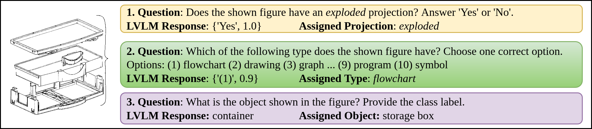

<div align="center">    
 
# Patent Figure Classification using Large Vision-language Models     

[](https://ecir2025.eu)

</div>

 

This is the official GitHub page for the paper ([Link](https://doi.org/10.1007/978-3-031-88711-6_2)):

> Sushil Awale, Eric Müller-Budack, Ralph Ewerth: "Patent Figure Classification using Large Vision-language Models". In: European Conference on Information Retrieval (ECIR), Lucca, Italy, 2025, Lecture Notes in Computer Science, vol 15573. Springer, Cham.

# Datasets

## Datasets Used

1. Extended CLEF-IP - https://doi.org/10.5281/zenodo.10019328
2. DeepPatent2 - https://doi.org/10.7910/DVN/UG4SBD

## Preparing PatFIGCLS and PatFIGVQA datasets

More details on [dataset/README.md](dataset/README.md)

### Download datasets

Download the dataset directly from Zenodo.org

1. [PatFigVQA Dataset](https://doi.org/10.5281/zenodo.14907472)
2. [PatFigCLS Dataset](https://doi.org/10.5281/zenodo.14905550)

# Finetuning

For finetuning of $\textbf{InstructBLIP}$ we use the $\textbf{LAVIS}$ (https://github.com/salesforce/LAVIS) library.

# Evaluation

For all CNN-based baselines, see [baselines/README.md](baselines/README.md).

For all LVLM-based classification, see [classifier/README.md](classifier/README.md)

# Citation

```BibTeX
@InProceedings{10.1007/978-3-031-88711-6_2,
author="Awale, Sushil
and M{\"u}ller-Budack, Eric
and Ewerth, Ralph",
title="Patent Figure Classification Using Large Vision-Language Models",
booktitle="Advances in Information Retrieval",
year="2025",
publisher="Springer Nature Switzerland",
address="Cham",
pages="20--37",
isbn="978-3-031-88711-6",
doi="https://doi.org/10.1007/978-3-031-88711-6_2"
}
```

# License

This work is published under the GNU GENERAL PUBLIC LICENSE Version 3, 29 June 2007. For details please check the LICENSE file in the repository.
